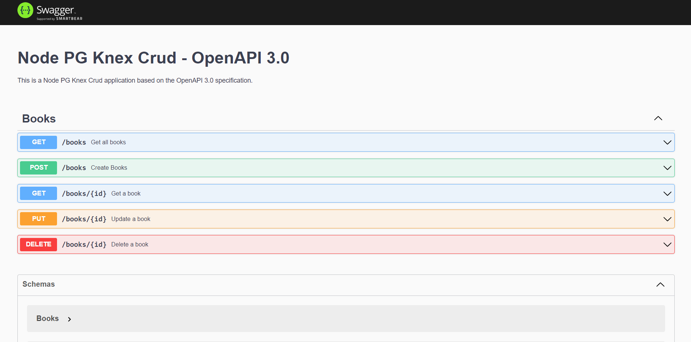

# Node PG Knex CRUD



The Application perform the simple CRUD operation.

This application present simple demonstration about the:
1. Usage of Knex
2. Usage of Swagger
3. Usage JSON Schema Validation
4. Usage of Unit Testing

## Built With
1. Node.js
2. Postgres SQL
3. Knex
4. Swagger


## Installation

1. Clone the repo
   ```sh
   git clone https://github.com/shekbruce/node_pg_knex_crud.git
   ```
2. Install NPM packages
   ```sh
   npm install
   ```

## Running the application

1. Create .env file and add below enironment variables
    * PORT
    * DB_CLIENT
    * DB_HOST
    * DB_PORT
    * DB_USER
    * DB_PASSWORD
    * DB_NAME
2. ```sh
   npm run dev-start
   ``` 
3. Go to http://localhost:PORT/  

## Running the the test
   ```sh
   npm run test
   ```
    

